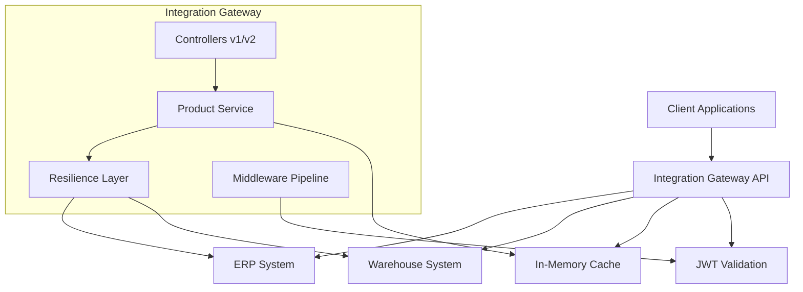
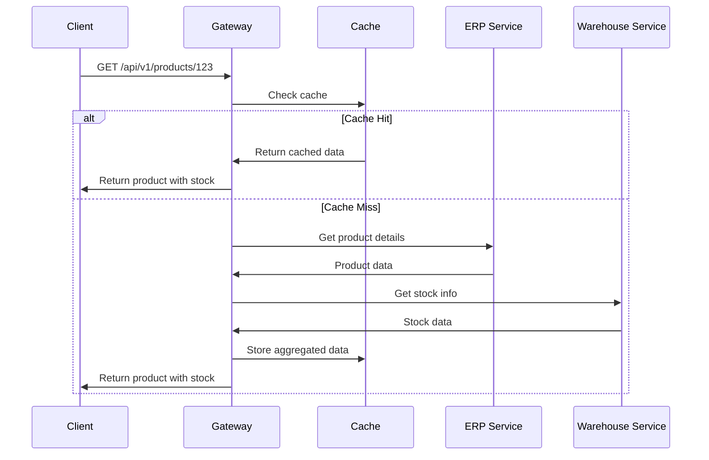
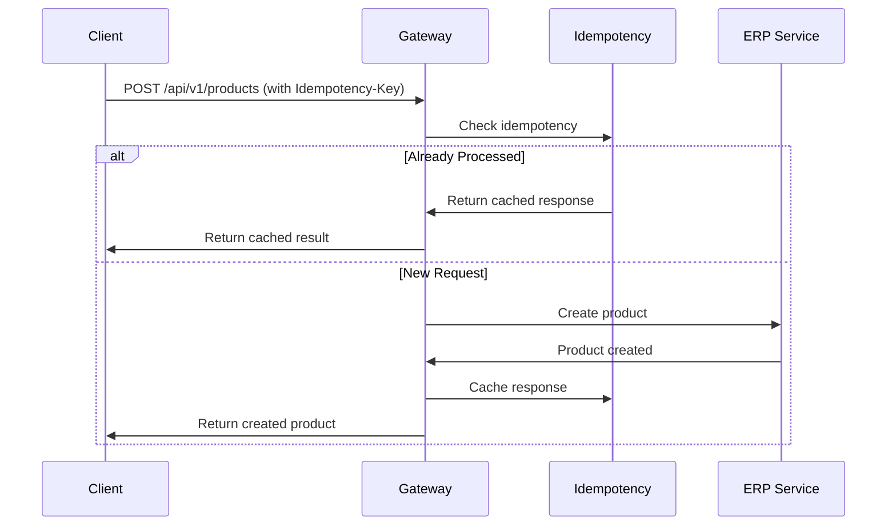

# Integration Gateway - System Design Document

## Table of Contents
1. [Overview](#overview)
2. [Architecture](#architecture)
3. [Design Patterns](#design-patterns)
4. [API Design](#api-design)
5. [Resilience & Reliability](#resilience--reliability)
6. [Security](#security)
7. [Data Flow](#data-flow)
8. [Performance Considerations](#performance-considerations)
9. [Monitoring & Observability](#monitoring--observability)
10. [Deployment Architecture](#deployment-architecture)
11. [Testing Strategy](#testing-strategy)

## Overview

The Integration Gateway is a robust microservice that provides a unified API interface for managing products by orchestrating data from upstream ERP and Warehouse systems. It implements enterprise-grade patterns for reliability, security, and performance while maintaining API versioning and backward compatibility.

### Key Features
- **Unified Product API**: Single interface aggregating ERP and Warehouse data
- **API Versioning**: Support for v1 and v2 APIs with backward compatibility
- **Resilience Patterns**: Circuit breakers, retry policies, and timeouts
- **Idempotency**: Guaranteed idempotent operations for data consistency
- **Caching**: Intelligent caching with TTL for performance optimization
- **Security**: JWT-based authentication and authorization
- **Observability**: Comprehensive logging and health checks

### Technology Stack
- **.NET 8.0**: Modern, cross-platform runtime
- **ASP.NET Core**: Web framework with built-in dependency injection
- **Polly**: Resilience and transient-fault-handling library
- **JWT**: JSON Web Tokens for authentication
- **Swagger/OpenAPI**: API documentation and testing
- **xUnit**: Unit testing framework
- **Docker**: Containerization support

## Architecture

### High-Level Architecture



### Component Architecture

```
┌─────────────────────────────────────────────────────────┐
│                    API Gateway                          │
├─────────────────────────────────────────────────────────┤
│  Controllers Layer (v1, v2)                            │
│  ├─ ProductsController v1                               │
│  └─ ProductsController v2                               │
├─────────────────────────────────────────────────────────┤
│  Middleware Pipeline                                    │
│  ├─ IdempotencyMiddleware                               │
│  ├─ AuthenticationMiddleware                            │
│  └─ ExceptionHandlingMiddleware                         │
├─────────────────────────────────────────────────────────┤
│  Service Layer                                          │
│  ├─ ProductService (Orchestration)                      │
│  ├─ CacheService (Thread-safe caching)                  │
│  └─ IdempotencyService (Operation deduplication)        │
├─────────────────────────────────────────────────────────┤
│  Infrastructure Layer                                   │
│  ├─ ErpClient (with resilience)                         │
│  ├─ WarehouseClient (with resilience)                   │
│  └─ HttpClients with Polly policies                     │
└─────────────────────────────────────────────────────────┘
```

## Design Patterns

### 1. Gateway Pattern
The service implements the API Gateway pattern to provide a unified interface that:
- Aggregates data from multiple upstream services
- Handles protocol translation and data transformation
- Implements cross-cutting concerns (auth, logging, caching)

### 2. Circuit Breaker Pattern
Prevents cascade failures by:
- Opening circuit after consecutive failures
- Allowing periodic health checks during half-open state
- Providing fallback responses when circuit is open

### 3. Retry Pattern with Exponential Backoff
Handles transient failures through:
- Exponential backoff with jitter to prevent thundering herd
- Configurable retry attempts and delay intervals
- Different policies for different failure types

### 4. Cache-Aside Pattern
Implements caching strategy where:
- Application manages cache explicitly
- Cache misses trigger upstream calls
- TTL prevents stale data issues

### 5. Idempotency Pattern
Ensures operation safety through:
- Composite keys (idempotency-key + operation + body hash)
- Response caching for repeated requests
- Automatic cleanup of expired idempotency records

## API Design

### RESTful Design Principles
- **Resource-based URLs**: `/api/v1/products/{id}`
- **HTTP verbs**: GET (read), POST (create), PUT (update), DELETE (remove)
- **Status codes**: Appropriate HTTP status codes for different scenarios
- **Content negotiation**: JSON as primary format

### Versioning Strategy
```
v1: /api/v1/products - Basic product information
v2: /api/v2/products - Enhanced with supplier, tags, metadata
```

#### Backward Compatibility
- v1 endpoints remain unchanged
- v2 provides enhanced responses with additional fields
- Shared business logic with different response mappers

### Error Handling (RFC 7807)
```json
{
  "type": "validation_error",
  "title": "Validation Error",
  "detail": "One or more validation errors occurred",
  "status": 400,
  "traceId": "0HN7KOKV3QR5V:00000001",
  "errors": {
    "Name": ["The Name field is required."]
  }
}
```

## Resilience & Reliability

### Circuit Breaker Configuration
```csharp
services.AddHttpClient<IErpService, ErpService>()
    .AddPolicyHandler(GetCircuitBreakerPolicy());

static IAsyncPolicy<HttpResponseMessage> GetCircuitBreakerPolicy()
{
    return Policy
        .HandleResult<HttpResponseMessage>(r => !r.IsSuccessStatusCode)
        .Or<HttpRequestException>()
        .CircuitBreakerAsync(
            handledEventsAllowedBeforeBreaking: 3,
            durationOfBreak: TimeSpan.FromSeconds(30));
}
```

### Retry Policy
```csharp
static IAsyncPolicy<HttpResponseMessage> GetRetryPolicy()
{
    return Policy
        .HandleResult<HttpResponseMessage>(r => !r.IsSuccessStatusCode)
        .Or<HttpRequestException>()
        .WaitAndRetryAsync(
            retryCount: 3,
            sleepDurationProvider: retryAttempt => 
                TimeSpan.FromSeconds(Math.Pow(2, retryAttempt)) + 
                TimeSpan.FromMilliseconds(Random.Shared.Next(0, 100)));
}
```

### Timeout Configuration
- HTTP client timeout: 30 seconds
- Circuit breaker timeout: 30 seconds
- Cache timeout: 5 minutes (configurable)

### Graceful Degradation
- Product data without stock information if warehouse is unavailable
- Cached responses when upstream services are down
- Health checks for dependency monitoring

## Security

### Authentication & Authorization
```csharp
[Authorize]
[HttpPost]
public async Task<ActionResult<ProductDto>> CreateProduct(
    [FromBody] CreateProductRequest request)
```

### JWT Configuration
```json
{
  "Jwt": {
    "SecretKey": "your-secret-key",
    "Issuer": "integration-gateway",
    "Audience": "api-consumers",
    "ValidateLifetime": true,
    "ValidateIssuerSigningKey": true
  }
}
```

### Security Headers
- Authorization: Bearer tokens for write operations
- Idempotency-Key: Required for POST/PUT operations
- Content-Type validation
- Request size limitations

### Input Validation
- Data annotations on DTOs
- Model validation in controllers
- SQL injection prevention (parameterized queries)
- XSS prevention through proper encoding

## Data Flow

### Read Operation (GET /api/v1/products/{id})


### Write Operation (POST /api/v1/products)


## Performance Considerations

### Caching Strategy
- **Cache Level**: Application-level (in-memory)
- **Cache Key**: Product ID or composite key for lists
- **TTL**: 5 minutes for product data, 2 minutes for stock data
- **Cache Size**: LRU eviction with size limits
- **Thread Safety**: ConcurrentDictionary for thread-safe operations

### Connection Pooling
- HttpClient singleton instances
- Connection reuse across requests
- Configurable timeout values
- Keep-alive connections

### Async/Await Pattern
- Non-blocking I/O operations
- Parallel execution for independent calls
- CancellationToken support for request cancellation
- ConfigureAwait(false) for library code

### Resource Management
- IDisposable pattern implementation
- Using statements for resource cleanup
- Connection string optimization
- Memory-efficient data structures

## Monitoring & Observability

### Health Checks
```csharp
builder.Services.AddHealthChecks()
    .AddCheck<ErpHealthCheck>("erp")
    .AddCheck<WarehouseHealthCheck>("warehouse");

app.MapHealthChecks("/health", new HealthCheckOptions
{
    ResponseWriter = UIResponseWriter.WriteHealthCheckUIResponse
});
```

### Logging Strategy
- **Structured Logging**: JSON format with correlation IDs
- **Log Levels**: Information, Warning, Error
- **Performance Logging**: Request duration and dependency calls
- **Error Logging**: Exception details with stack traces

### Metrics & Telemetry
- Request count and duration
- Cache hit/miss ratios
- Circuit breaker state changes
- Upstream service response times
- Error rates by endpoint

### Distributed Tracing
- Correlation IDs across service boundaries
- Request flow visualization
- Performance bottleneck identification
- Cross-service dependency mapping

## Deployment Architecture

### Container Strategy
```dockerfile
FROM mcr.microsoft.com/dotnet/aspnet:8.0 AS base
WORKDIR /app
EXPOSE 80
EXPOSE 443

FROM mcr.microsoft.com/dotnet/sdk:8.0 AS build
WORKDIR /src
COPY ["IntegrationGateway.csproj", "."]
RUN dotnet restore
COPY . .
RUN dotnet build -c Release -o /app/build

FROM build AS publish
RUN dotnet publish -c Release -o /app/publish

FROM base AS final
WORKDIR /app
COPY --from=publish /app/publish .
ENTRYPOINT ["dotnet", "IntegrationGateway.dll"]
```

### Environment Configuration
- Development: Local development with stub services
- Testing: Automated testing with mocked dependencies
- Staging: Pre-production environment with test data
- Production: Live environment with real dependencies

### Scaling Considerations
- Stateless design for horizontal scaling
- Load balancer compatibility
- Database connection pooling
- Cache warming strategies

## Testing Strategy

### Test Pyramid
```
┌─────────────────────────────────┐
│        E2E Tests (Few)          │ ← Full system integration
├─────────────────────────────────┤
│    Integration Tests (More)     │ ← API endpoints, middleware
├─────────────────────────────────┤
│     Unit Tests (Many)          │ ← Business logic, services
└─────────────────────────────────┘
```

### Unit Testing
- Service layer testing with mocked dependencies
- Idempotency logic verification
- Cache behavior testing
- Error handling scenarios

### Integration Testing
- API endpoint testing with TestServer
- Middleware pipeline testing
- Database integration testing
- External service integration testing

### Performance Testing
- Load testing with concurrent requests
- Stress testing for breaking points
- Cache performance benchmarks
- Memory usage profiling

### Contract Testing
- API contract validation
- Backward compatibility testing
- Schema validation testing
- Consumer-driven contract tests

---

## Conclusion

The Integration Gateway implements a comprehensive set of enterprise patterns to provide a reliable, secure, and performant API for product management. The architecture supports future growth through its modular design, comprehensive testing strategy, and robust operational characteristics.

### Key Architectural Benefits
1. **Reliability**: Circuit breakers and retry policies prevent cascade failures
2. **Performance**: Multi-layer caching and async operations optimize response times
3. **Security**: JWT authentication and comprehensive input validation protect against threats
4. **Maintainability**: Clean architecture and comprehensive testing enable safe evolution
5. **Observability**: Extensive logging and monitoring provide operational visibility
6. **Scalability**: Stateless design and resource efficiency support horizontal scaling

This design serves as the foundation for a production-ready integration platform that can evolve with business requirements while maintaining high standards for reliability and performance.