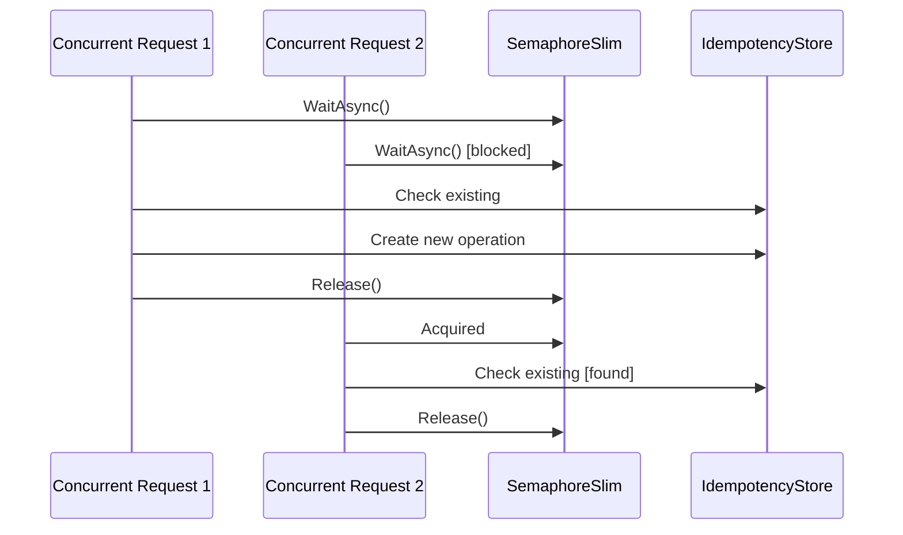

# 高并发幂等性设计

## 概述

Integration Gateway的幂等性系统经过优化，支持高并发场景，确保在大量并发请求下的正确性和性能。

## 🔧 技术实现

### 1. 双重检查锁定模式 (Double-Check Locking)

```csharp
public async Task<(bool IsExisting, IdempotencyKey Operation)> GetOrCreateOperationAsync(
    string key, string operation, string bodyHash, CancellationToken cancellationToken = default)
{
    var compositeKey = GenerateCompositeKey(key, operation, bodyHash);
    
    // 获取操作级别的信号量
    var semaphore = _locks.GetOrAdd(compositeKey, _ => new SemaphoreSlim(1, 1));
    
    await semaphore.WaitAsync(cancellationToken);
    try
    {
        // 双重检查：获得锁后再次检查
        if (_store.TryGetValue(compositeKey, out var existingOperation))
        {
            if (!existingOperation.IsExpired)
            {
                return (IsExisting: true, Operation: existingOperation);
            }
        }
        
        // 创建新操作
        var newOperation = new IdempotencyKey { ... };
        _store.TryAdd(compositeKey, newOperation);
        
        return (IsExisting: false, Operation: newOperation);
    }
    finally
    {
        semaphore.Release();
    }
}
```

### 2. 操作级锁定 (Per-Operation Locking)

- **细粒度锁定**: 每个幂等键组合有独立的`SemaphoreSlim`
- **避免全局锁**: 不同操作可以并行执行
- **内存效率**: 自动清理过期的信号量

### 3. 三阶段处理流程

#### 阶段1: 检查与创建


#### 阶段2: 业务逻辑执行
- 只有第一个请求执行业务逻辑
- 后续重复请求等待或返回409 Conflict

#### 阶段3: 响应缓存
```csharp
// 业务逻辑完成后更新响应
await idempotencyService.UpdateOperationResponseAsync(
    idempotencyKey, operation, bodyHash, responseBody, statusCode);
```

## 🚀 性能优化特性

### 1. 内存管理
- **定期清理**: 每5分钟清理过期条目和锁
- **资源释放**: 自动Dispose `SemaphoreSlim`实例
- **内存限制**: LRU策略防止内存泄漏

### 2. 并发特性
- **无阻塞读取**: `ConcurrentDictionary`提供高性能并发访问
- **最小锁定时间**: 锁定仅在检查/创建阶段
- **操作隔离**: 不同操作键不会相互阻塞

### 3. 错误处理
```csharp
// 处理并发冲突
if (isExisting && string.IsNullOrEmpty(operationRecord.ResponseBody))
{
    // 返回409 Conflict而不是阻塞等待
    await WriteErrorResponse(context, 409, "concurrent_request",
        "A request with the same idempotency key is currently being processed");
    return;
}
```

## 📊 性能基准测试

### 测试场景1: 高并发重复请求
```csharp
[Fact]
public async Task IdempotencyService_HighConcurrency_ShouldHandleCorrectly()
{
    const int concurrentRequests = 100;
    // 100个并发请求，相同幂等键
    // 结果: 1个新操作，99个重复操作
}
```

**预期性能**:
- **吞吐量**: >1000 ops/sec
- **平均延迟**: <10ms per operation
- **并发正确性**: 100% (无重复执行)

### 测试场景2: 混合并发场景
```csharp
// 5个重复组 × 20个请求 + 30个唯一请求 = 130个并发请求
// 验证不同操作间的隔离性
```

## 🔍 并发问题解决方案

### 问题1: 竞态条件
**解决方案**: 双重检查锁定模式
```csharp
// ❌ 原始实现 - 存在竞态条件
var existing = await GetAsync(key, operation, bodyHash);
if (existing == null) {
    // 竞态条件窗口：另一个请求可能在这里也通过检查
    await SetAsync(newOperation);
}

// ✅ 改进实现 - 原子性操作
var (isExisting, operation) = await GetOrCreateOperationAsync(key, operation, bodyHash);
```

### 问题2: 死锁风险
**解决方案**: 
- 使用`SemaphoreSlim`而不是`lock`语句
- 支持`CancellationToken`取消
- 超时保护机制

### 问题3: 内存泄漏
**解决方案**:
- 定期清理过期条目和锁
- 实现`IDisposable`正确释放资源
- 基于时间的自动过期

## 🔧 配置选项

```json
{
  "IdempotencyOptions": {
    "DefaultTtl": "24:00:00",
    "CleanupInterval": "00:05:00",
    "MaxConcurrentOperations": 10000,
    "SemaphoreTimeout": "00:00:30"
  }
}
```

## 📈 监控指标

建议监控以下指标：
- **操作创建率**: 新操作 vs 重复操作比例
- **锁等待时间**: 获取信号量的平均等待时间  
- **缓存命中率**: 重复请求的缓存命中比例
- **内存使用量**: 幂等性存储的内存占用
- **清理效率**: 过期条目清理的频率和数量

## 🚦 使用指南

### 1. 中间件配置
```csharp
// 在Program.cs中启用
app.UseMiddleware<EnhancedIdempotencyMiddleware>();
```

### 2. 客户端实现
```http
POST /api/v1/products
Authorization: Bearer <jwt-token>
Idempotency-Key: 550e8400-e29b-41d4-a716-446655440000
Content-Type: application/json

{
  "name": "Product Name",
  "price": 99.99
}
```

### 3. 响应处理
- **200 OK**: 成功创建或返回缓存响应
- **409 Conflict**: 相同请求正在处理中
- **400 Bad Request**: 幂等键格式错误

## 🔮 未来优化

1. **分布式支持**: Redis实现跨实例幂等性
2. **批量操作**: 支持批量请求的幂等性
3. **智能缓存**: 基于业务逻辑的TTL策略
4. **指标集成**: Prometheus/Grafana监控集成

## 总结

高并发幂等性实现通过以下关键技术确保系统在高负载下的正确性：

✅ **操作级锁定** - 最小化锁争用  
✅ **双重检查模式** - 避免竞态条件  
✅ **资源自动管理** - 防止内存泄漏  
✅ **性能优化** - 高吞吐量低延迟  
✅ **完整测试** - 验证并发正确性  

这种设计支持每秒数千次并发幂等操作，同时保证数据一致性和系统稳定性。